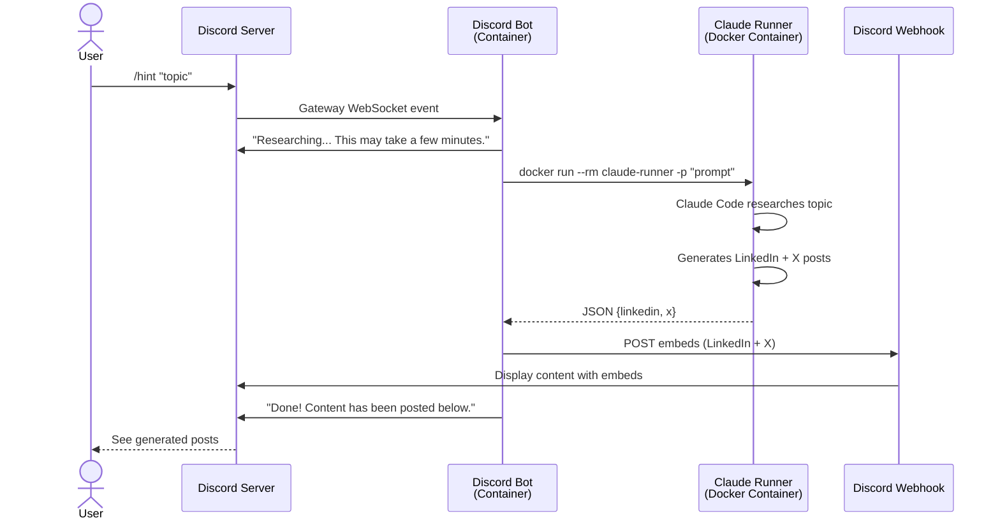

# Social Media Publisher for AI Content

An AI-powered content generation system for building a personal brand around AI and agentic coding. The system accepts content hints via Discord, uses Claude API to research topics, and generates platform-specific social media posts.

## Architecture

The system uses a simple Docker-based architecture with Discord integration.

### Components

- **Discord Bot**: discord.js v14 bot running in Docker container
- **Claude Runner**: Docker container with Claude Code CLI pre-installed
- **Discord Webhook**: Posts generated content back to Discord

### How It Works

1. **Submit Hint**: User types `/hint "topic"` in Discord
2. **Bot Receives Command**: Discord Gateway pushes command to bot via WebSocket
3. **Spawn Claude Runner**: Bot spawns a Docker container with Claude Code CLI
4. **Content Generation**: Claude Code researches the topic and generates platform-specific posts (LinkedIn, X)
5. **Post Results**: Bot posts generated content to Discord via webhook with rich embeds

### Architecture Diagram



## Target Platforms (v1)

- **LinkedIn** - Professional thought leadership
- **X (Twitter)** - Punchy threads

## Discord Bot

The Discord bot provides the interface for the content generation system:

- Runs as a Docker container behind NAT (no public endpoints needed)
- Connects to Discord Gateway via WebSocket (outbound only)
- Listens for `/hint "topic"` slash command
- Spawns Claude Runner container to generate content
- Posts results to Discord via webhook

The bot is fully NAT-friendly and can run on VPS, AWS ECS/Fargate, or locally without requiring public IP addresses or inbound ports.

See [docs/discord-bot.md](./docs/discord-bot.md) for setup and deployment instructions.

## Tech Stack

| Component | Technology |
|-----------|-----------|
| Discord Bot | discord.js v14 + TypeScript + Docker |
| Content Generation | Claude Code CLI (via Docker) |
| Configuration | Zod validation |
| Logging | Pino structured logging |

## Quick Start

### Prerequisites

- Docker installed
- Discord bot token and application configured
- Claude API key (Anthropic)

### Setup

1. **Build Claude Runner Image**:
   ```bash
   cd claude-runner
   docker build -t claude-runner:1.0 .
   ```

2. **Configure Discord Bot**:
   ```bash
   cd discord-bot
   cp .env.example .env
   # Edit .env with Discord tokens and API credentials
   npm install
   npm run register-commands  # Register slash commands with Discord
   ```

3. **Run Bot Locally** (for testing):
   ```bash
   npm run dev
   ```

4. **Deploy Bot** (production):
   ```bash
   # Using Docker Compose
   docker compose up -d

   # Or deploy to AWS ECS/Fargate, VPS, etc.
   ```

## Project Structure

```
social-media-publisher/
├── discord-bot/           # Discord bot (TypeScript + discord.js)
│   ├── src/
│   │   ├── commands/      # Slash commands (/hint)
│   │   ├── services/      # ClaudeRunner, WebhookClient
│   │   ├── config.ts      # Zod-validated configuration
│   │   ├── logger.ts      # Pino structured logging
│   │   └── index.ts       # Bot entry point
│   ├── Dockerfile
│   ├── docker-compose.yml
│   └── .env.example
├── claude-runner/         # Claude Code CLI Docker image
│   └── Dockerfile
├── docs/
│   ├── architecture.md                      # Architecture decisions
│   ├── data-sources.md                      # Data sources research
│   ├── data-sources-implementation.md       # Implementation specs
│   └── discord-bot.md                       # Discord bot documentation
├── requirements.md        # Detailed requirements + architecture diagram
└── README.md             # This file
```

## Environment Variables

```bash
# Discord Configuration
DISCORD_TOKEN=your-bot-token
DISCORD_CLIENT_ID=your-application-client-id
DISCORD_GUILD_ID=your-discord-server-id
DISCORD_CHANNEL_ID=channel-id-for-content-threads
DISCORD_WEBHOOK_URL=https://discord.com/api/webhooks/xxx/yyy

# Claude API
ANTHROPIC_API_KEY=your-api-key

# Docker
CLAUDE_RUNNER_IMAGE=claude-runner:1.0

# Logging
LOG_LEVEL=info  # debug, info, warn, error
```

## Documentation

| Document | Contents |
|----------|----------|
| [Requirements](./requirements.md) | Full requirements with architecture diagram |
| [Architecture & Tech Stack](./docs/architecture.md) | Original tech decisions (CLI-based MVP) |
| [Discord Bot Guide](./docs/discord-bot.md) | Discord bot setup, configuration, deployment |
| [Data Sources - Research](./docs/data-sources.md) | AI news source research (for future automation) |
| [Data Sources - Implementation](./docs/data-sources-implementation.md) | API contracts and schemas (for future automation) |

## Status

### Completed

- [x] Project requirements and architecture design
- [x] Discord bot scaffold (TypeScript + discord.js v14)
- [x] `/hint` slash command implementation
- [x] Claude Runner Docker image (Claude Code CLI)
- [x] ClaudeRunner service (spawns Docker container, parses output)
- [x] WebhookClient service (posts embeds to Discord)
- [x] Bot Dockerfile + docker-compose.yml
- [x] Zod-validated configuration
- [x] Structured logging (Pino)
- [x] Graceful shutdown handling

### Next Steps

- [ ] End-to-end testing with real Discord server
- [ ] Prompt template refinement for better content quality
- [ ] Error handling improvements (retry logic, timeout handling)
- [ ] Persistent storage for hint history
- [ ] Web UI for reviewing/editing generated content

## Notes

The original design in [docs/architecture.md](./docs/architecture.md) was a local CLI-based tool. The architecture evolved to a simple Docker-based system with Discord integration for better collaboration. The data source research documents remain relevant for future automated content scanning features.

Earlier iterations explored a serverless AWS architecture with API Gateway, Lambda, DynamoDB, and SQS, but the design was simplified to the current Docker-based approach for faster development and easier deployment.
