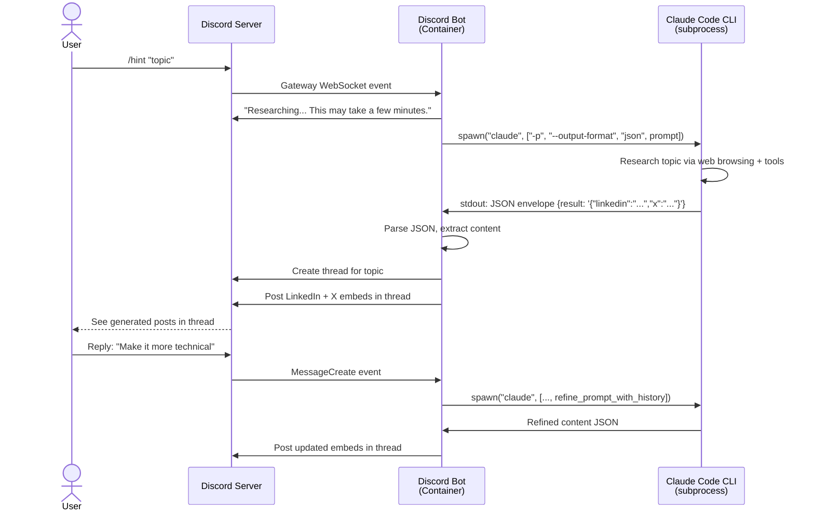

# Social Media Publisher for AI Content

An AI-powered content generation system for building a personal brand around AI and agentic coding. The system accepts content hints via Discord, uses Claude Code CLI to research topics, and generates platform-specific social media posts.

## Architecture

The system uses a simple single-container Docker architecture with Discord integration and embedded Claude Code CLI.

### Components

- **Discord Bot**: discord.js v14 bot running in Docker container
- **Claude Code CLI**: Embedded in container, spawned as subprocess for content generation

### How It Works

1. **Submit Hint**: User types `/hint "topic"` in Discord
2. **Bot Receives Command**: Discord Gateway pushes command to bot via WebSocket
3. **Content Generation**: Bot spawns Claude Code CLI as subprocess to research topic and generate platform-specific posts (LinkedIn, X)
4. **Create Thread**: Bot creates a dedicated thread for the topic
5. **Post Results**: Bot posts generated content as embeds in the thread
6. **Iterative Refinement**: Users reply in thread to refine content, bot regenerates based on conversation history

### Architecture Diagram



## Target Platforms (v1)

- **LinkedIn** - Professional thought leadership
- **X (Twitter)** - Punchy tweets

## Discord Bot

The Discord bot provides the interface for the content generation system:

- Runs as a single Docker container behind NAT (no public endpoints needed)
- Connects to Discord Gateway via WebSocket (outbound only)
- Listens for `/hint "topic"` slash command
- Creates dedicated threads for each topic (auto-archive: 24 hours)
- Spawns Claude Code CLI as subprocess to generate content
- Posts rich embeds (LinkedIn + X) in threads
- Processes thread replies to enable iterative refinement
- Fully NAT-friendly (can run on VPS, AWS ECS/Fargate, or locally)

See [docs/discord-bot.md](./docs/discord-bot.md) for detailed setup and deployment instructions.

## Tech Stack

| Component | Technology |
|-----------|-----------|
| Discord Bot | discord.js v14 + TypeScript + Docker |
| Content Generation | Claude Code CLI (embedded in bot image via npm) |
| Process Management | Node.js child_process.spawn() |
| Configuration | Zod validation |
| Logging | Pino structured logging |

## Quick Start

### Prerequisites

- Docker installed
- Discord bot token and application configured
- Claude Code OAuth token (from `~/.claude.json` after running `claude` locally)

### Setup

1. **Configure Discord Bot**:
   ```bash
   cd discord-bot

   # Create .env file
   cat > .env << EOF
   DISCORD_TOKEN=your-bot-token
   DISCORD_CLIENT_ID=your-application-client-id
   DISCORD_GUILD_ID=your-discord-server-id
   DISCORD_CHANNEL_ID=channel-id-for-content-threads
   CLAUDE_CODE_OAUTH_TOKEN=your-claude-code-oauth-token
   LOG_LEVEL=info
   EOF

   # Install dependencies
   npm install

   # Register slash commands with Discord
   npm run register-commands
   ```

2. **Run Locally** (development):
   ```bash
   npm run dev
   ```

3. **Deploy with Docker** (production):
   ```bash
   # From project root
   cd /home/michal/code/social-media-publisher

   # Build Docker image
   docker build -t social-media-publisher ./discord-bot

   # Run with startup script
   ./start-discord-bot.sh

   # Or using Docker Compose
   cd discord-bot
   docker compose up -d
   ```

## Project Structure

```
social-media-publisher/
├── discord-bot/                  # Discord bot (TypeScript + discord.js)
│   ├── src/
│   │   ├── commands/
│   │   │   └── hint.ts           # /hint slash command
│   │   ├── handlers/
│   │   │   └── thread-reply.ts   # Thread reply handler for refinement
│   │   ├── services/
│   │   │   └── claude-runner.ts  # Claude CLI integration via spawn()
│   │   ├── config.ts             # Zod-validated configuration
│   │   ├── logger.ts             # Pino structured logging
│   │   ├── index.ts              # Bot entry point
│   │   └── register-commands.ts  # Slash command registration
│   ├── Dockerfile                # Multi-stage build: bot + Claude CLI
│   ├── docker-compose.yml        # Production deployment config
│   ├── package.json
│   └── tsconfig.json
├── docs/
│   ├── discord-bot.md            # Discord bot documentation
│   ├── architecture.md           # Architecture decisions
│   ├── data-sources.md           # Data sources research
│   └── data-sources-implementation.md
├── start-discord-bot.sh          # Docker run script (4GB memory, --env-file)
├── requirements.md               # Detailed requirements
└── README.md                     # This file
```

## Environment Variables

```bash
# Discord Configuration
DISCORD_TOKEN=your-bot-token                        # From Discord Developer Portal
DISCORD_CLIENT_ID=your-application-client-id        # From Discord Developer Portal
DISCORD_GUILD_ID=your-discord-server-id             # Right-click server → Copy Server ID
DISCORD_CHANNEL_ID=channel-id-for-content-threads   # Right-click channel → Copy Channel ID

# Claude Code Authentication (OAuth token, NOT API key)
CLAUDE_CODE_OAUTH_TOKEN=your-oauth-token            # From ~/.claude.json after auth

# Logging
LOG_LEVEL=info  # debug, info, warn, error
```

**Important**: Use `CLAUDE_CODE_OAUTH_TOKEN`, NOT `ANTHROPIC_API_KEY` or `ANTHROPIC_AUTH_TOKEN`. The Claude Code CLI requires OAuth authentication.

### Getting Claude Code OAuth Token

```bash
# Run Claude Code CLI locally and authenticate
claude -p "hello"
# Follow OAuth flow in browser

# Extract token from config
cat ~/.claude.json | jq -r '.oauthTokens[0].access_token'
```

## Docker Configuration

### Multi-Stage Build

**Stage 1 (Builder)**:
- Installs all dependencies
- Compiles TypeScript → JavaScript

**Stage 2 (Runtime)**:
- Installs Claude Code CLI globally: `npm install -g @anthropic-ai/claude-code`
- Pre-populates config files:
  - `~/.claude.json` - Trust dialogs accepted, onboarding completed
  - `~/.claude/settings.json` - Theme preference
- Copies production dependencies and compiled code
- Warmup: `claude -p "hello"` before starting bot

### Startup Script

`start-discord-bot.sh` runs the bot container:

```bash
#!/usr/bin/env bash
set -euo pipefail
SCRIPT_DIR="$(cd "$(dirname "${BASH_SOURCE[0]}")" && pwd)"
IMAGE="social-media-publisher"
ENV_FILE="${SCRIPT_DIR}/discord-bot/.env"
docker run --rm --name discord-bot --memory=4g --env-file "${ENV_FILE}" "$IMAGE"
```

Features:
- Auto-cleanup (`--rm`)
- 4GB memory limit
- Loads `.env` via `--env-file`
- Passes `CLAUDE_CODE_OAUTH_TOKEN` to container

## Usage

### 1. Submit a Content Hint

In Discord:
```
/hint topic:"Stack Overflow traffic drops because of AI"
```

Bot responds:
```
Researching "Stack Overflow traffic drops because of AI"... This may take a few minutes.
```

### 2. Bot Creates Thread

Bot creates a thread named after the topic and posts:
```
**Content generated for:** Stack Overflow traffic drops because of AI

[LinkedIn Embed - Blue]
[Generated professional thought leadership content]

[X Embed - Black]
[Generated punchy tweet]

Reply in this thread to refine the content. I'll adjust based on your feedback.
```

### 3. Iterative Refinement

User replies in thread:
```
Make it more technical
```

Bot shows typing indicator, then posts:
```
**Updated content:**

[Updated LinkedIn Embed]
[Updated X Embed]
```

Continue refining by replying again. Conversation history (up to 50 messages) is maintained automatically by Discord.

## Key Implementation Details

### Claude Runner Service

Spawns Claude Code CLI as subprocess:

```typescript
const child = spawn("claude", ["-p", "--output-format", "json", prompt], {
  stdio: ["ignore", "pipe", "pipe"],  // stdin MUST be "ignore" or CLI hangs
  env: process.env,
});
```

**Critical**: `stdio: ["ignore", "pipe", "pipe"]` - stdin must be ignored, otherwise Claude CLI waits for interactive input and hangs indefinitely.

### Output Parsing

Claude Code `--output-format json` wraps output in envelope:
```json
{
  "result": "{\"linkedin\": \"...\", \"x\": \"...\"}"
}
```

Parser:
1. Extracts `.result` field from JSON envelope
2. Handles markdown code blocks (```json ... ```)
3. Re-escapes newlines (envelope parsing converts `\n` to literal newlines)
4. Parses inner JSON with linkedin/x fields

### Thread-Based Refinement

- Bot listens for `MessageCreate` events in threads
- Fetches conversation history (up to 50 messages)
- Converts Discord messages to role-based format:
  - Bot messages → `role: "assistant"` (includes embed content)
  - User messages → `role: "user"`
- Passes history to `runner.refine(history)`
- Posts updated embeds in thread

## Documentation

| Document | Contents |
|----------|----------|
| [Discord Bot Guide](./docs/discord-bot.md) | Detailed setup, configuration, deployment, troubleshooting |
| [Requirements](./requirements.md) | Full requirements with architecture diagram |
| [Architecture & Tech Stack](./docs/architecture.md) | Original tech decisions (CLI-based MVP) |
| [Data Sources - Research](./docs/data-sources.md) | AI news source research (for future automation) |
| [Data Sources - Implementation](./docs/data-sources-implementation.md) | API contracts and schemas (for future automation) |

## Status

### Completed

- [x] Project requirements and architecture design
- [x] Discord bot scaffold (TypeScript + discord.js v14)
- [x] `/hint` slash command implementation
- [x] Thread-based workflow with auto-archive (24 hours)
- [x] ClaudeRunner service (spawns Claude CLI subprocess, parses JSON output)
- [x] Thread reply handler for iterative refinement
- [x] Conversation history collection and management
- [x] Dockerfile with embedded Claude Code CLI
- [x] Multi-stage Docker build with config pre-population
- [x] Warmup command in Docker CMD
- [x] docker-compose.yml for single-container deployment
- [x] Startup script with memory limits and env file loading
- [x] Zod-validated configuration
- [x] Structured logging (Pino)
- [x] Graceful shutdown handling

### Next Steps

- [ ] End-to-end testing with real Discord server
- [ ] Prompt template refinement for better content quality
- [ ] Error handling improvements (retry logic, better timeout handling)
- [ ] Persistent storage for hint history (DynamoDB or SQLite)
- [ ] Web UI for reviewing/editing generated content before posting
- [ ] Support for additional platforms (Bluesky, Threads, etc.)
- [ ] Automated content scheduling and publishing

## Deployment

### Local/VPS

```bash
# Clone repository
git clone <repository>
cd social-media-publisher

# Configure environment
cd discord-bot
cp .env.example .env  # Or create .env manually
# Edit .env with credentials

# Build and run
cd ..
docker build -t social-media-publisher ./discord-bot
./start-discord-bot.sh
```

### AWS ECS Fargate

1. Push image to ECR:
   ```bash
   docker build -t social-media-publisher ./discord-bot
   docker tag social-media-publisher:latest <account>.dkr.ecr.<region>.amazonaws.com/social-media-publisher:latest
   docker push <account>.dkr.ecr.<region>.amazonaws.com/social-media-publisher:latest
   ```

2. Create ECS task definition:
   - Image: ECR image URI
   - Environment variables: DISCORD_*, CLAUDE_CODE_OAUTH_TOKEN, LOG_LEVEL
   - Memory: 4GB
   - CPU: 2 vCPU

3. Deploy as Fargate service:
   - VPC: Private subnet with NAT Gateway
   - No load balancer needed (bot is outbound-only)
   - Desired count: 1

## Troubleshooting

### Bot doesn't respond to commands

1. Check slash commands are registered: `npm run register-commands`
2. Verify bot permissions in Discord server
3. Check Message Content Intent is enabled in Developer Portal
4. View logs: `docker compose logs -f discord-bot`

### Content generation fails

1. Verify `CLAUDE_CODE_OAUTH_TOKEN` is set (NOT `ANTHROPIC_API_KEY`)
2. Test Claude CLI manually:
   ```bash
   docker run -it --env-file discord-bot/.env social-media-publisher sh
   claude -p --output-format json "Test prompt"
   ```

### Claude CLI hangs

- **Cause**: stdin is not set to "ignore" in spawn() call
- **Fix**: Ensure `stdio: ["ignore", "pipe", "pipe"]` in claude-runner.ts

### Docker container crashes

1. Check all required env vars in `.env`
2. Verify `CLAUDE_CODE_OAUTH_TOKEN` format (should be OAuth token, not API key)
3. View logs: `docker compose logs discord-bot`

See [docs/discord-bot.md](./docs/discord-bot.md) for detailed troubleshooting.

## Notes

The original design in [docs/architecture.md](./docs/architecture.md) was a local CLI-based tool. The architecture evolved to a Docker-based system with Discord integration and thread-based refinement for better collaboration and user experience.

Earlier iterations explored serverless AWS architecture (API Gateway, Lambda, DynamoDB, SQS), but the design was simplified to the current single-container approach for faster development, easier deployment, and lower operational complexity. The bot is fully NAT-friendly and requires no public endpoints.
