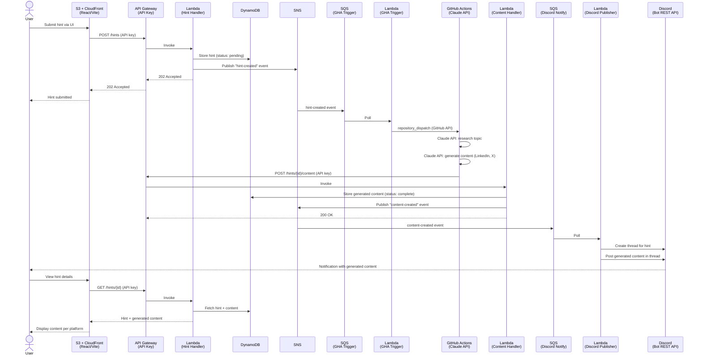

# Requirements

## Architecture

- **Frontend**: React app via Vite (CloudFront + S3 static site)
- **API**: API Gateway (API key auth) + Lambda
- **Storage**: DynamoDB
- **Messaging**: SNS → SQS → Lambda (event-driven pipeline)
- **Compute**: GitHub Actions (Claude API research + content generation)
- **Notifications**: Discord Bot REST API (`@discordjs/rest`) — threads per hint, no Gateway/WebSocket needed
- **IaC**: Terraform (deployed to AWS)

## Target Platforms (v1)

- LinkedIn
- X (Twitter)

## Architecture Diagram

## Tech Stack

| Component | Technology |
|-----------|-----------|
| Frontend | React + Vite |
| API | API Gateway + Lambda (Node.js/TypeScript) |
| Storage | DynamoDB (single-table design) |
| Messaging | SNS + SQS |
| AI | Claude API (`@anthropic-ai/sdk`) via GitHub Actions |
| Discord | `@discordjs/rest` (REST-only, no WebSocket/Gateway) |
| IaC | Terraform |
| CI/CD | GitHub Actions |

## Pages

### Hints

- List of all hints provided by the user
- Option to add new hints
- Each hint is expandable to show:
  - Hint details (topic/thesis, date added, status)
  - List of generated content per platform (LinkedIn, X)

## Core Flow

1. User adds a hint (topic/thesis) via the React UI
2. API Gateway (API key) → Lambda stores hint in DynamoDB, publishes SNS "hint-created"
3. SNS → SQS → Lambda calls GitHub API `repository_dispatch` to trigger workflow
4. GitHub Actions uses Claude API to research and generate content for LinkedIn & X
5. GitHub Actions POSTs results back to API Gateway (API key)
6. Lambda stores generated content in DynamoDB, publishes SNS "content-created"
7. SNS → SQS → Lambda creates a Discord thread for the hint and posts content
8. User reviews generated content in the UI or Discord thread

## SNS Topics & Subscribers

| Topic | Event | SQS → Lambda Subscriber |
|-------|-------|------------------------|
| `hint-events` | `hint-created` | GHA Trigger Lambda (calls `repository_dispatch`) |
| `content-events` | `content-created` | Discord Publisher Lambda (creates thread + posts) |

## API Endpoints

| Method | Path | Auth | Description |
|--------|------|------|-------------|
| POST | /hints | API key | Submit a new hint |
| GET | /hints | API key | List all hints |
| GET | /hints/{id} | API key | Get hint with generated content |
| POST | /hints/{id}/content | API key | Store generated content (called by GHA) |

## Discord Integration

- **Bot REST API** (`@discordjs/rest`) — no Gateway/WebSocket, no persistent process
- Runs entirely in Lambda — pure HTTP calls with bot token
- On "content-created" event:
  1. Create a new thread in the designated channel, titled with the hint topic
  2. Post generated content per platform as messages within the thread
  3. Store `discordThreadId` on the hint record in DynamoDB for future reference
- Allows conversation/feedback within the thread

## DynamoDB Schema (Draft)

### Single-table design

| PK | SK | Attributes |
|----|-----|------------|
| `HINT#{id}` | `METADATA` | topic, status (pending/processing/complete), discordThreadId, createdAt, updatedAt |
| `HINT#{id}` | `CONTENT#{platform}` | platform (linkedin/x), body, generatedAt, sources[] |
