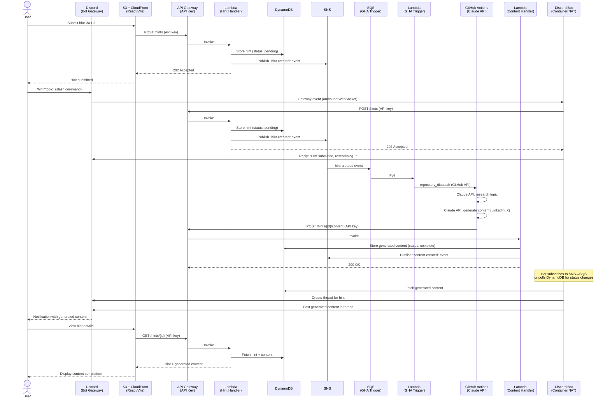

# Requirements

## Architecture

- **Frontend**: React app via Vite (CloudFront + S3 static site)
- **API**: API Gateway (API key auth) + Lambda
- **Storage**: DynamoDB
- **Messaging**: SNS → SQS → Lambda (event-driven pipeline)
- **Compute**: GitHub Actions (Claude API research + content generation)
- **Discord**: Bot (discord.js) running as container behind NAT — bidirectional (input + output)
- **IaC**: CloudFormation (deployed to AWS)

## Target Platforms (v1)

- LinkedIn
- X (Twitter)

## Architecture Diagram

## Tech Stack

| Component | Technology |
|-----------|-----------|
| Frontend | React + Vite |
| API | API Gateway + Lambda (Node.js/TypeScript) |
| Storage | DynamoDB (single-table design) |
| Messaging | SNS + SQS |
| AI | Claude API (`@anthropic-ai/sdk`) via GitHub Actions |
| Discord Bot | discord.js (full client with Gateway WebSocket) |
| IaC | CloudFormation |
| CI/CD | GitHub Actions |

## Discord Bot

### Deployment

- Runs as a **container behind NAT** (e.g., ECS Fargate, local Docker, or cheap VPS)
- Connects **outbound** to Discord Gateway via WebSocket — no inbound ports, no public IP needed
- NAT-friendly: bot initiates all connections, Discord pushes events over the established WebSocket

### Why this works behind NAT

- Discord Gateway is a **WebSocket** connection initiated by the bot (outbound)
- All events (messages, slash commands, reactions) are pushed to the bot over this connection
- Bot sends REST API calls (create threads, post messages) outbound via HTTPS
- Zero inbound traffic required — fully compatible with NAT, private subnets, firewalls

### Capabilities (bidirectional)

**Input (Discord → System):**
- `/hint "topic"` slash command → bot calls POST /hints API → triggers full pipeline
- Users can submit hints directly from Discord without opening the web UI

**Output (System → Discord):**
- Bot listens for "content-created" events (via SNS→SQS or DynamoDB polling)
- Creates a thread per hint in designated channel
- Posts generated content per platform in the thread
- Stores `discordThreadId` on hint record in DynamoDB

### Discord Bot vs Lambda REST-only (decision rationale)

| | Lambda + `@discordjs/rest` | Container + `discord.js` |
|---|---|---|
| Bidirectional | No (output only) | Yes (input + output) |
| Slash commands | Requires public Interactions Endpoint URL | Works via Gateway (no public URL) |
| Always on | No (event-driven) | Yes (WebSocket connection) |
| NAT-friendly | N/A (runs in Lambda) | Yes (outbound only) |
| Cost | Pay per invocation | Container hosting cost |
| Complexity | Lower | Slightly higher |

**Chosen: Container + discord.js** — enables Discord as a full input channel, works behind NAT, no public endpoints needed.

## Pages

### Hints

- List of all hints provided by the user
- Option to add new hints (web UI or Discord `/hint` command)
- Each hint is expandable to show:
  - Hint details (topic/thesis, date added, status, source: web/discord)
  - Link to Discord thread (if exists)
  - List of generated content per platform (LinkedIn, X)

## Hint Input Channels

| Channel | Method |
|---------|--------|
| Web UI | React app → POST /hints |
| Discord | `/hint` slash command → Bot → POST /hints |

## Core Flow

1. User adds a hint via **Web UI** or **Discord `/hint` command**
2. API Gateway (API key) → Lambda stores hint in DynamoDB, publishes SNS "hint-created"
3. SNS → SQS → Lambda calls GitHub API `repository_dispatch` to trigger workflow
4. GitHub Actions uses Claude API to research and generate content for LinkedIn & X
5. GitHub Actions POSTs results back to API Gateway (API key)
6. Lambda stores generated content in DynamoDB, publishes SNS "content-created"
7. Discord bot picks up event, creates thread, posts content
8. User reviews generated content in the Web UI or Discord thread

## SNS Topics & Subscribers

| Topic | Event | Subscriber |
|-------|-------|------------|
| `hint-events` | `hint-created` | SQS → Lambda (GHA Trigger via `repository_dispatch`) |
| `content-events` | `content-created` | SQS → Discord Bot (create thread + post content) |

## API Endpoints

| Method | Path | Auth | Description |
|--------|------|------|-------------|
| POST | /hints | API key | Submit a new hint (from web UI or Discord bot) |
| GET | /hints | API key | List all hints |
| GET | /hints/{id} | API key | Get hint with generated content |
| POST | /hints/{id}/content | API key | Store generated content (called by GHA) |

## DynamoDB Schema (Draft)

### Single-table design

| PK | SK | Attributes |
|----|-----|------------|
| `HINT#{id}` | `METADATA` | topic, status (pending/processing/complete), source (web/discord), discordThreadId, createdAt, updatedAt |
| `HINT#{id}` | `CONTENT#{platform}` | platform (linkedin/x), body, generatedAt, sources[] |
