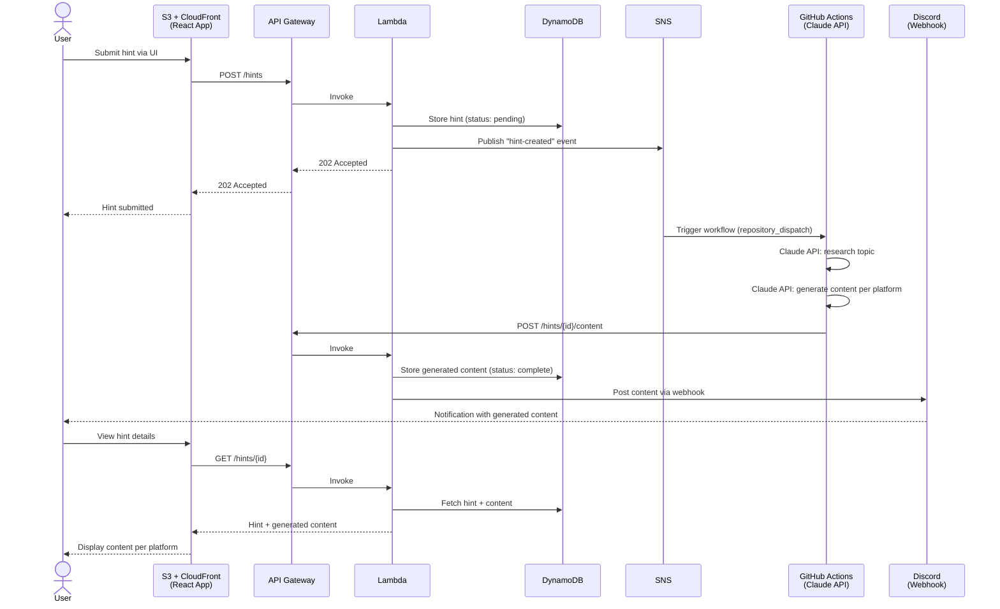

# Requirements

## Architecture

- **Frontend**: React app (CloudFront + S3 static site)
- **API**: API Gateway + Lambda
- **Storage**: DynamoDB
- **Messaging**: SNS (event bus)
- **Compute**: GitHub Actions (Claude API research + content generation)
- **Notifications**: Discord (webhook)

## Architecture Diagram

## Pages

### Hints

- List of all hints provided by the user
- Option to add new hints
- Each hint is expandable to show:
  - Hint details (topic/thesis, date added, status)
  - List of generated content per platform (LinkedIn, Twitter/X, Facebook, Discord, etc.)

## Core Flow

1. User adds a hint (topic/thesis) via the React UI
2. API Gateway → Lambda stores hint in DynamoDB, publishes SNS event
3. SNS triggers GitHub Actions workflow via `repository_dispatch`
4. GitHub Actions uses Claude API (via OAuth/sub) to research and generate content
5. GitHub Actions POSTs results back to API Gateway
6. Lambda stores generated content in DynamoDB + sends Discord notification
7. User reviews generated content in the UI (or via Discord)

## API Endpoints

| Method | Path | Description |
|--------|------|-------------|
| POST | /hints | Submit a new hint |
| GET | /hints | List all hints |
| GET | /hints/{id} | Get hint with generated content |
| POST | /hints/{id}/content | Store generated content (called by GHA) |

## DynamoDB Schema (Draft)

### Hints Table
- **PK**: `HINT#{id}`
- **SK**: `METADATA`
- **Attributes**: topic, status (pending/processing/complete), createdAt, updatedAt

### Content (same table, different SK)
- **PK**: `HINT#{id}`
- **SK**: `CONTENT#{platform}`
- **Attributes**: platform, body, generatedAt, sources[]
